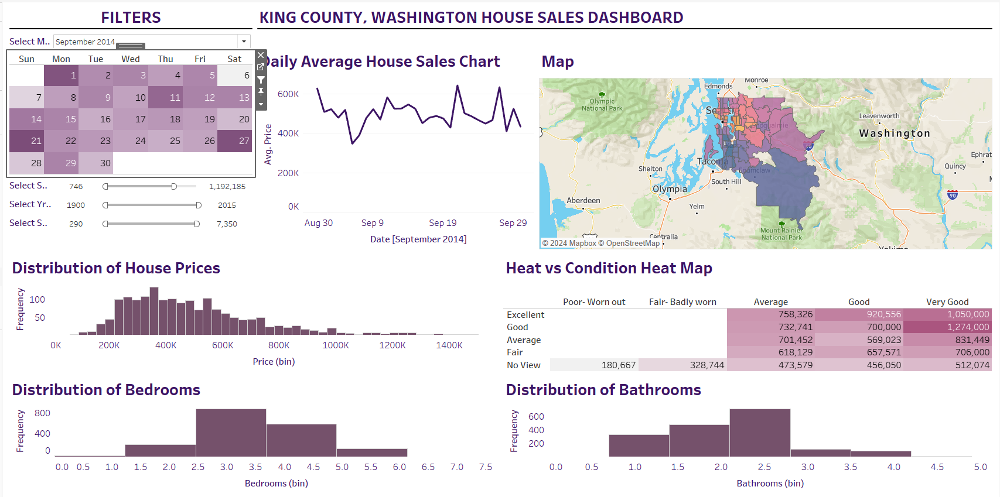

# King_County_House_Sales
Complete Tableau Project using House Sales Data

## Overview

Welcome to the Tableau Dashboard for King_County_House_Sales. This dashboard provides an interactive and visual representation of the impacted sales trends on Houses in King County; it provides a date wise visualization of daily average house sales with an open street map provided indicating zip codes with average prices, various histograms and heatmaps give distribution of bedrooms, bathrooms, view vs condition maps affecting frequency of sales are provided with available filters such as built year, sqft living, sqft lot. It is designed to help stakeholders quickly and effectively gain insights into key metrics and trends.

## Contents

1. [Introduction]
2. [Data Sources]
3. [Dashboard Structure]
4. [Navigation]
5. [User Instructions]
6. [Troubleshooting]

## Introduction

This dashboard is developed to provide a comprehensive view of House Sales Data. It leverages Tableau's powerful data visualization capabilities to enable users to explore data through interactive charts and graphs.

## Data Sources

The data used in this dashboard comes from the following sources:
Data consists of ID, date, price, number of bedrooms and bathrooms sqft living and lot, number of floors, wavefront, view, conditions, grade, built year, zipcode, latitude and longitude.  

## Dashboard Structure

The dashboard consists of the following sections:
- A high-level summary of key metrics.
- In-depth views of changes in average price of sales with filters on built year(between 1900 & 2015), sqft living(between 290 & 7480) and sqft lot(between 746 & 1,651,359). 
- Comparative metrics across Daily Average House Price Sales, Map(zipcode) vs Average sales, Distribution of House Prices, View vs Condition HeatMap, Distribution of bedrooms and bathrooms respectively.

## Navigation

To navigate the dashboard:
- Use the Month and Year tab provided on the top.
- Click on the specific date provided on the Calendar to drill down into more detailed data.
- Use filters on the bottom of Calendar to customize the data displayed.

## User Instructions

1. Filtering Data:
   - Select filter options to narrow down the data. For example, choose year built from 2010 - 2015 to customize results.
2. Exploring Data:
   - Click on charts to explore more detailed views. Use the drill-down feature to see data at different granularity levels.
3. Exporting Data:
   - Use the export button to download data tables or charts for offline analysis.

## Troubleshooting

- No Data Displayed: Ensure that your filters are not too restrictive.
- Slow Performance: This could be due to large data volumes. Try narrowing down your filters or view a less granular level of data.
- Export Issues: Ensure your Tableau permissions allow data export. Contact the admin if you encounter issues.

